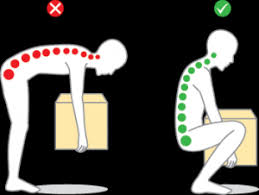
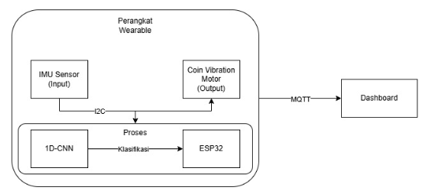
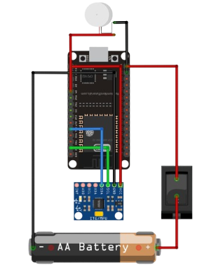
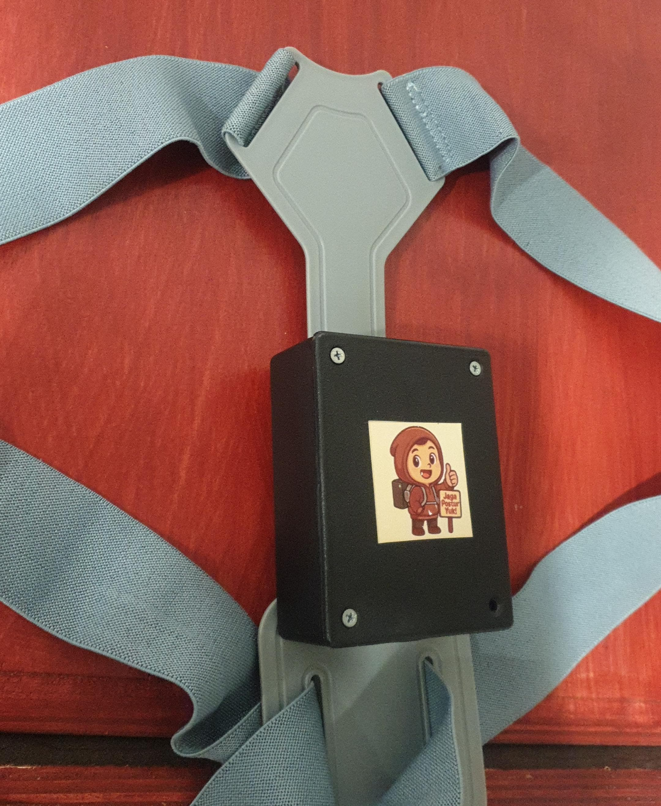

# Wearable Device untuk Mendeteksi Postur Tubuh saat Mengangkat Beban

  

### K2A - Kelompok 3 - Anggota : 
- Zenitha Shaula Lora   (225150301111034)
- Audrey Zakiya Trustee (225150307111003)	
- Adinni Salsabillah 	(225150307111014)
- Afwan Maulana Sidqi 	(225150307111033)
- Alfi Hisan Usri 		(225150307111048)

## Deskripsi Proyek
Wearable device ini berfungsi untuk mendeteksi postur tubuh saat mengangkat beban secara real-time berdasarkan data akselerasi dan kecepatan sudut dari sensor IMU. Model klasifikasi yang digunakan adalah 1D-CNN dengan tiga kelas: tegak, bungkuk, dan miring. Sistem akan memberikan notifikasi berupa getaran jika postur pengguna tidak ideal (bungkuk/miring), serta menampilkan data postur pada dashboard berbasis web.

## Alat yang Digunakan
- **MPU6050** : Sensor IMU (akselerasi dan gyroscope)
- **ESP32** : Mikrokontroler utama
- **Coin Vibration Motor** : Aktuator getaran sebagai peringatan
- **Switch** : Untuk menyalakan/mematikan perangkat
- **Baterai Li-ion 3.7V 2800mAh**
- **TensorFlow Lite** : Untuk menjalankan model ML di ESP32
- **MQTT (Mosquitto)** : Protokol komunikasi
- **Flask API** : Dashboard data visualisasi

## Arsitektur Sistem

### Berikut merupakan arsitektur dari sistem ini:

### 1. Blok Diagram

### 2. Wiring Diagram

### 3. Perangkat Wearable

## Algoritma yang Digunakan
### 1D-CNN
Model 1D-CNN telah dilatih sebelumnya untuk mengenali pola gerakan berdasarkan urutan data dari sensor MPU6050. Model ini diimplementasikan dalam ESP32 dan digunakan untuk mengklasifikasikan postur tubuh pengguna ke dalam kategori yang telah ditentukan (tegak, bungkuk, miring).

## Dashboard

## Demo
Video demo berikut menunjukkan bagaimana sistem wearable ini bekerja saat mendeteksi perubahan postur tubuh pengguna:

<video controls src="asset/img/Demo_Alat.mp4" title="Demo Alat"></video>